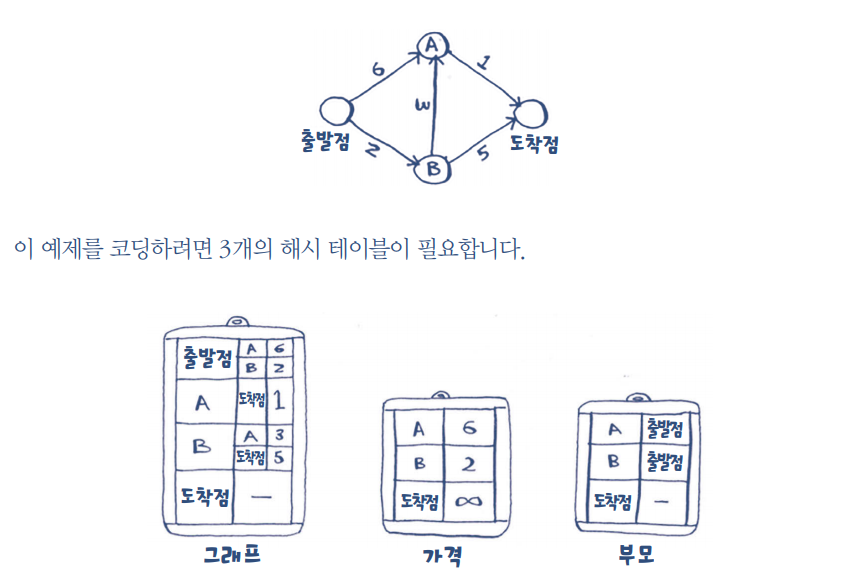
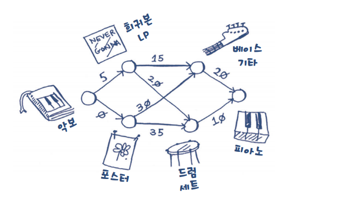

# 7. 다익스트라 알고리즘 

# 1. 너비우선 탐색 vs 다익스트라  알고리즘

- 너비 우선 탐색 : 가장 빠른 길이 아닌 가장 짧은 길(적은 구간). 즉 최단 경로를 의미한다. ⇒ 최단 경로
- 다익스트라 알고리즘:  구간에 가중치를 두어 최단 시간 경로를 구한다. ⇒ 최단 시간 경로

---

# 2. 다익스트라 알고리즘

- 4 단계 순서
1. 가장 가격이 싼 정점, 즉 도달하는 데 가장 적게 걸리는 정점을 찾습니다. (비용 테이블 에서 처리 안된 노드 중 가장 싼 것 찾기) 
2. 이 정점의 이웃 정점에 대해 현재 가격보다 싼 경로가 있는지 확인하고, 존재한다면 가격을 수정합니다.(그래프 테이블에서 조회, 비용테이블과 부모테이블 업데이트) 
3. 그래프 상의 모든 정점에 대해 1~2를 반복합니다. 
4. 최종 경로를 계산합니다. 

---

# 3. 용어 설명

- 가중치: 그래프에서 각 간선의 숫자
    - 가중 그래프 : 가중치가 존재하는 그래프  ⇒ 다익스트라 알고리즘 사용
    - 균일 그래프: 가중치가 없는 그래프 ⇒ 너비 우선 탐색 사용
- 사이클: 무방향 그래프. 다익스트라 알고리즘은 방향성 비순환 그래프(DAG)에만 적용됩니다.

---

# 5. 간선의 가중치가 음수인 경우

- 다익스트라 알고리즘은 음수 가중치는 처리할 수 없다. ⇒ 벨만-포드 알고리즘 사용해야 한다.

# 6. 구현

## 6-1. 빠른 경로 찾기 소스 구현

[기본 소스](https://github.com/JUNGEEYOU/Dijkstras_algorithm/blob/master/dijkstras_algorithm_basic.py)

## 6-2. 물물 교환 로직 구현

